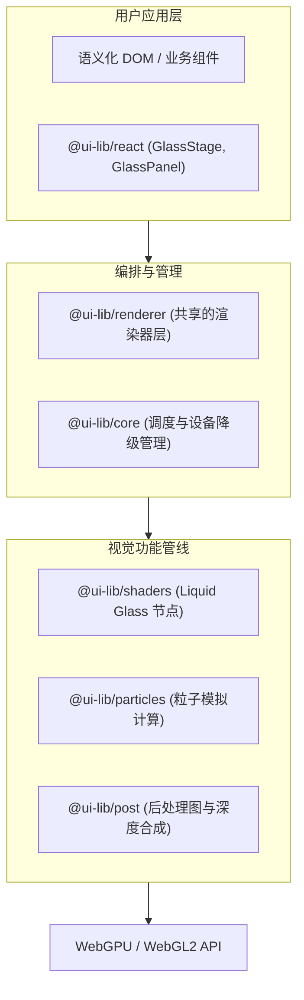

<h1 align="center">UI-Lib</h1>

<p align="center">面向 Web 的 GPU 优先动效与视觉效果运行时，为普通网页注入魔法。</p>

<p align="center">
  [<a href="https://9222596184d8478fab867413d73b1698.sg2.agentos-app.run">在线演示</a>] [<a href="./docs/ROADMAP.md">路线图</a>]
</p>

<p align="center">
  <a href="https://github.com/Ghost-Silver/UI-Lib/blob/main/LICENSE"></a>
  <a href="#"></a>
  <a href="#"></a>
</p>

> [!TIP]
> **想看看实际效果吗？**
>
> 体验不同场景下的视觉能力（部署于 `apps/docs`，打开即滑）：
> - 🧊 **Liquid Glass Pro:** [点此查看](https://9222596184d8478fab867413d73b1698.sg2.agentos-app.run/?demo=liquid-glass)（基于真实 DOM 的多层玻璃与折射）
> - ✨ **Lumen (Product Hero):** [点此查看](https://9222596184d8478fab867413d73b1698.sg2.agentos-app.run/?demo=product-hero)
> - 🎞️ **Scroll Cinema:** [点此查看](https://9222596184d8478fab867413d73b1698.sg2.agentos-app.run/?demo=scroll-cinema)
> - 🖱️ **Cursor Field:** [点此查看](https://9222596184d8478fab867413d73b1698.sg2.agentos-app.run/?demo=cursor-field)
> - 🌌 **Aurora Flow:** [点此查看](https://9222596184d8478fab867413d73b1698.sg2.agentos-app.run/?demo=aurora-flow)
> - 💫 **Wake:** [点此查看](https://9222596184d8478fab867413d73b1698.sg2.agentos-app.run/?demo=wake)
> - 🍬 **Candy Glass:** [点此查看](https://9222596184d8478fab867413d73b1698.sg2.agentos-app.run/?demo=candy-glass)（粉彩粒子与圆润徽章，萌系那条线）
>
> 在 URL 后追加 `?fallback=1` 强制查看 CSS 降级效果；追加 `?backend=webgl` 强制使用 WebGL2 渲染。

你是否也曾在开发 Web 界面时陷入两难：是用可访问性极佳但效果平淡的常规 DOM 和 CSS，还是砸上一个华丽却完全阻断 DOM 流的 Canvas 游戏引擎 Demo？

UI-Lib 将实时 Liquid Glass（液体玻璃）、GPU 粒子、3D 场景和 TSL（Three Shading Language）后处理带入了普通网页界面。它的目标绝不是用 Canvas 替代语义化 HTML，而是**附着于文档之上，作为装饰性的魔法增强层**。

## 核心设计理念

- **DOM 仍然是 DOM。** 文本、链接、表单、焦点和布局都保留在语义化 HTML 中。
- **共享的渲染宇宙。** 整个页面仅使用一个 Canvas、一个 Renderer 和一个 Scheduler 来承载所有效果，告别资源失控。
- **极致的渐进增强。** 优先 WebGPU，自动回退 WebGL2；在没有 GPU 或开启了 Reduced Motion 时，平稳回退到优雅的 CSS 形态。
- **唯一着色器语言。** 统一基于 TSL 节点图，自动编译为 WGSL 或 GLSL，抹平跨端差异。

> [!NOTE]
>
> 即使不熟悉 WebGPU 的开发者，只要使用 React 环境，就能轻松组合出极具高级感的视觉组件。如果您熟悉 Three.js 或对图形编程充满热情，欢迎探索底层的 `@ui-lib/shaders` 和 `@ui-lib/renderer`！

## 当前能力与进度

目前我们已经能做到：

- [x] **Liquid Glass (液体玻璃)**
  - [x] 真实 DOM 元素映射到 WebGPU 渲染层
  - [x] 基于 SDF 的真实屏幕空间折射与 Bevel 边缘
  - [x] 支持 RGB 色散、霜冻模糊、边缘高光、Fresnel 与动态指针互动
- [x] **GPU 粒子场 (GPU Particles)**
  - [x] 包含引力、湍流、涡旋的流场力学
  - [x] 基于屏幕空间的多层深度混合 (`scene`, `inside`, `front`)
  - [x] WebGPU Compute 路径与 WebGL2 Transform-feedback 回退
- [x] **TSL 后处理 (Post Processing)**
  - [x] 泛光 (Bloom)、镜头光晕、色差与暗角
  - [x] 焦点模糊、方向运动模糊与时间帧累积抗锯齿 (TAA)
  - [x] 自适应降级与质量档位调度 (Adaptive Quality Tier)
- [x] **萌系那条线 (Candy)**
  - [x] `FIELD_LOOKS.pastel`：柔和粉彩粒子云，`intensity` 0.46，比 aurora 更暗，不会压住旁边的字
  - [x] `GLASS_LOOKS.iris`：全圆角、宽亮边、淡粉色调，读起来像一颗有光泽的小珠子
  - [x] `LENS_LOOKS.sakura` / `peach`：樱花与蜜桃两种镜头档位
  - [x] `BubbleBadge`：面向小标签的圆润徽章，文字仍是可选中、可聚焦的真 DOM
- [ ] **增强动效叙事层 (施工中)**
  - [x] 与 Scheduler 同步的无尽滚动与章节编排
  - [x] React SSR 安全的组件适配与 Fallback 样式
  - [ ] 完整的时间线编排与 MSDF 文本渲染
  - [ ] 面向 Vue / Svelte 的适配层

## 快速开发指南

### 本地启动

请确保您拥有 Node.js `>= 20.19` 以及 pnpm `12.x` 环境。

```shell
# 安装依赖
pnpm install

# 启动本地开发 Playground
pnpm dev
```

### React 用法尝鲜

下面展示了如何在保留语义的情况下，通过 `GlassStage` 渲染复杂的折射材质与粒子：

```tsx
import { GlassPanel, GlassStage, ParticleField } from "@ui-lib/react";

export function MagicHero() {
  return (
    <GlassStage
      backdrop={{
        type: "gradient",
        colors: ["#16255e", "#7b2ff7", "#f107a3", "#00d4ff"],
      }}
      post={{
        bloomStrength: 0.4,
        chromaticAberration: 0.8,
      }}
    >
      {/* 粒子在统一的共享图层内演算 */}
      <ParticleField
        options={{
          count: 24_000,
          forces: { turbulence: 2.2 },
          colors: ["#5eead4", "#a78bfa"],
        }}
      />

      {/* 这个卡片会对背景的渐变和粒子产生光线追踪级的屏幕折射 */}
      <GlassPanel
        radius={34}
        refraction={46}
        dispersion={0.3}
        className="magic-card"
      >
        <h2>真实的文本内容。</h2>
        <p>您的 SEO、无障碍辅助和文本选中能力全都在这里。</p>
      </GlassPanel>
    </GlassStage>
  );
}
```

### 工程门禁

如果你计划贡献代码，请在提交前执行门禁验证：

```shell
# 1. 执行验证：构建 → 类型检查 → 测试 → 体积预算
pnpm verify

# 2. 代码静态检查与格式化
pnpm lint

# 3. 运行 Headless 浏览器验收测试
pnpm test:e2e
```

`pnpm test` 自己会先 `pnpm build`。包入口指向 `dist/`，跳过构建的话跨包测试解析不到。
`pnpm size` 读 `size-budget.json`，给七个包的 `dist/index.js` 与 `index.d.ts` 设上限，超了就以非零码退出。

#### 真机门禁（需要真实 GPU，不进 CI）

上面三条是语义验收，不是像素门禁：仓库里没有截图 baseline，测试文件里也没有 `toHaveScreenshot`，
所以它证明的是 DOM、降级路径和生命周期契约，不是 Metal 或独显上真正画出了什么。

真机侧另有两条命令，它们**刻意不进 CI**——CI 是 headless 的，macOS 上 headless Chromium 会回退到
SwiftShader，那描述的是软件光栅化器，不是用户的机器：

```shell
pnpm build
pnpm --filter @ui-lib/docs preview --host 127.0.0.1 --port 4173 --strictPort

# 真机帧节奏测量，按 GPU 分桶写入 reports/device/
pnpm measure

# 真机着色器/管线编译门禁（有头 Chromium + 真 GPU）
pnpm check:shaders
pnpm check:shaders:self-test   # 证伪探针本身：确认门禁不是瞎的
```

`check:shaders` patch 了 `GPUDevice.prototype.createShaderModule` 与 `requestDevice`，把 three 从不读取的
`getCompilationInfo()` 结果、无人认领的 `uncapturederror` 事件和 `queue.submit` 次数都收上来，然后逐页断言：
没有失败的着色器模块、没有未捕获的 WebGPU 校验错误，且 WebGPU 侧**确实创建过 device、创建过着色器模块、
提交过命令缓冲**——一个什么都没渲染的页面是安静的，这几条让它无法靠沉默过关。

#### 「链路开着」不等于「链路在跑」

真机测量最有价值的一条经验：**后处理链配置上开着，不等于它在画东西**。第一版性能记录就是栽在这里——
链在两条后端上都没干活，而当时的数字看起来完全正常。

判断链路是否真的生效，不要靠看截图，要用两个独立检查：

1. `pnpm check:shaders` 给出确切的着色器模块数与管线数；
2. **「透传态 vs 关闭态」的像素残差**：`enabled: false` 的链路应当等价于完全不跑链路。
   健康值在 1 以下，实测 0.92；第一版是 10.61，即链路输入是错的。

按现有数据，**可以当基线的只有 `p50` 和「是否出现 16.7 ms 台阶」**；`max` 与 `>16.7ms` 计数在两次运行之间
可以差一倍以上，不适合做门禁。完整记录见 [`docs/benchmarks`](./docs/benchmarks/README.md)。

## 架构概览



## 开发命令

```bash
pnpm install              # 安装依赖
pnpm dev                  # Vite Playground
pnpm verify               # 门禁：build → typecheck → test → size budget
pnpm verify:device        # 上面的全部 + 真机着色器编译门禁
pnpm test                 # 先构建 dist，再跑 Vitest
pnpm typecheck            # 全 workspace TypeScript
pnpm size                 # 体积预算门禁（读 size-budget.json）
pnpm lint                 # Biome check
pnpm format               # Biome format --write
pnpm build                # 包构建
pnpm test:watch           # Vitest watch 模式
pnpm test:e2e             # Playwright 浏览器验收（headless Chromium）
pnpm test:e2e:update      # 更新视觉 baseline（需能安装浏览器）
pnpm measure              # 真机帧节奏测量（需要真实 GPU；脚本不会启停服务器）
pnpm check:shaders        # 真机着色器/管线编译门禁（需要真实 GPU；先构建 apps/docs）
pnpm check:shaders:self-test  # 证伪探针本身：确认门禁不是瞎的
```

## 特别感谢

该项目底层的光学效果灵感与渲染思路源于各类先锋的 WebGL Demo 实践，并受现代基于浏览器的图形框架（特别是 [Three.js](https://threejs.org)）支持。感谢所有推动 Web 前端图形生态发展的开发者！

## 许可证

本项目基于 [MIT License](LICENSE) 授权。
